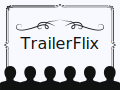

# TrailerFlix

> TrailerFlix is a web application with the goal of displaying movie trailers. Users can watch trailers, explore different categories, and filter videos by name.

### Technologies Used
- React.js: JavaScript library for building user interfaces.
- Context API: Global state management to share trailers between components.

### Features
- Display of movie trailers through a simple interface.
- Random sorting of trailers on each load.
- Dynamic filtering of trailers based on the movie name.
- Context for managing the state of trailers within the application.

## 🤝 Colaborators

We would like to thank the following people who contributed to this project:

<table>
  <tr>
    <td align="center">
      <a href="https://github.com/GabrielFRCordeiro" title="GitHub do Gabriel Cordeiro">
         
        <b>Gabriel Cordeiro</b>
      </a>
    </td>
  </tr>
</table>
